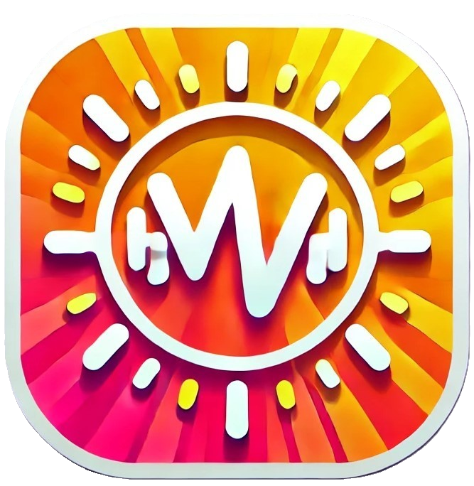

# CDS Dashboard Web

Modern dashboard application built with Next.js and TypeScript

## Preview



## Technologies

<p align="center">
  <a href="https://nextjs.org/" target="_blank">
  
  </a>
  <a href="https://www.typescriptlang.org/" target="_blank">
  
  </a>
  <a href="https://tailwindcss.com/" target="_blank">
  
  </a>
  <a href="https://tanstack.com/query/latest" target="_blank">
  
  </a>
  <a href="https://github.com/pmndrs/zustand" target="_blank">
  
  </a>
  <a href="https://socket.io/" target="_blank">
  
  </a>
</p>

## Project Structure🗂️

```
├── app/
├── components/
├── src/
│   ├── api/
│   ├── components/
│   ├── config/
│   ├── helpers/
│   ├── models/
│   ├── pages/
│   ├── services/
│   └── utils/
├── public/
└── styles/
```

## Getting Started

### Prerequisites📦

- Node.js v20.13.1 or higher
- NPM

### Installation📍

1. Clone the repository
```bash
git clone https://github.com/proyectohhss2025-unad/vibra-web.git
```

2. Install dependencies
```bash
npm install
```

3. Run the development server
```bash
npm run dev
```

Open [http://localhost:3000](http://localhost:3000) with your browser to see the result.

## Features📍

- Modern dashboard interface
- Real-time updates with Socket.io
- State management with Zustand
- Data fetching with React Query
- Responsive design with Tailwind CSS

## Author ✒️

_Built by_

- **Yovany Suárez Silva** - _Full Stack Software Engineer_ - [desobsesor](https://github.com/desobsesor)
- Website - [https://portfolio.cds.net.co](https://desobsesor.github.io/portfolio-web/)

## License 📄

This project is under the MIT License - see the file [LICENSE.md](LICENSE.md) for details
